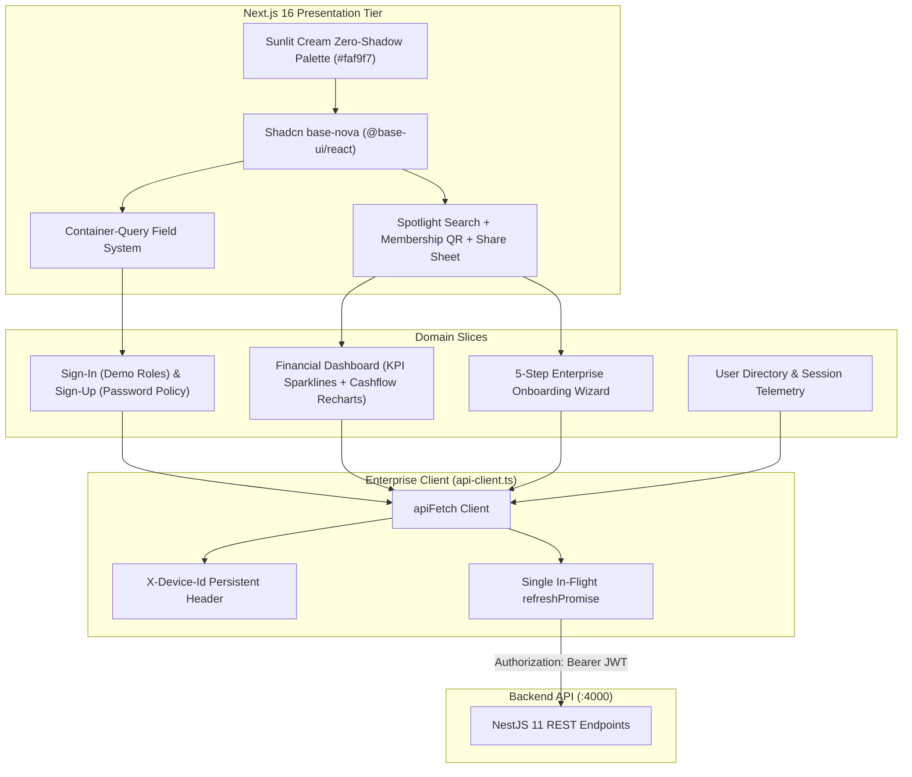

# Fanaye Technologies Enterprise Frontend Next.js Boilerplate (2026 Edition)
> **The High-Assurance Zero-Shadow Presentation Tier & Design System for Enterprise SaaS Platforms**  
> *Next.js 16 (React 19) + Tailwind CSS v4 + Shadcn base-nova (@base-ui/react) + Container-Query Forms + Zero-Shadow Tonal Hierarchy + Living Memory*

---

[](https://nodejs.org/)
[](https://nextjs.org/)
[](https://react.dev/)
[](https://tailwindcss.com/)
[](https://base-ui.com/)
[](https://recharts.org/)
[](https://marketplace.visualstudio.com/items?itemName=natinaelsamuel.memo-living-memory)

---

## Author & Governance

- **Principal Architect & Author**: **Natinael Samuel**
- **Edition**: 2026 Enterprise Release
- **Organization**: **Fanaye Technologies**
- **Direct Contact**: [`afritioalberts1216@gmail.com`](mailto:afritioalberts1216@gmail.com)
- **Phone / Telegram**: `+251904161978`
- **Living Memory Extension**: [Memo - Living Memory (VS Code Marketplace)](https://marketplace.visualstudio.com/items?itemName=natinaelsamuel.memo-living-memory)

---

## Table of Contents

1. [Executive Summary & Design Invariants](#1-executive-summary--design-invariants)
2. [High-Level Frontend Architecture](#2-high-level-frontend-architecture)
3. [Project Directory Map](#3-project-directory-map)
4. [Zero-Shadow Tonal Hierarchy System](#4-zero-shadow-tonal-hierarchy-system)
5. [Shadcn `base-nova` UI Primitive Suite](#5-shadcn-base-nova-ui-primitive-suite)
6. [Shared Composite Micro-UI Components](#6-shared-composite-micro-ui-components)
7. [Domain Slices & Interactive Application Views](#7-domain-slices--interactive-application-views)
8. [Enterprise API Client & Token Deduplication](#8-enterprise-api-client--token-deduplication)
9. [The Three Core Frontend Agent Skills](#9-the-three-core-frontend-agent-skills)
10. [Memo - Living Memory VS Code Extension](#10-memo---living-memory-vs-code-extension)
11. [Quick Start & Developer Onboarding](#11-quick-start--developer-onboarding)
12. [Complete Command Reference Matrix](#12-complete-command-reference-matrix)

---

## 1. Executive Summary & Design Invariants

The **Fanaye Technologies Enterprise Frontend Next.js Boilerplate (2026 Edition)** provides an ultra-modern, high-performance presentation tier engineered for data-dense enterprise SaaS platforms. Powered by Next.js 16 App Router, React 19, and Tailwind CSS v4, it enforces four strict invariants:

1. **Zero-Shadow Elevation**:
   - Heavy drop shadows (`shadow-md`, `shadow-lg`, `shadow-xl`) are strictly prohibited on data tables, metric cards, dialogs, and navigation bars.
   - Elevation is achieved purely through calibrated OkLCH tonal contrast:
     - `--canvas-cream` (`#faf9f7`): Viewport body background.
     - `--surface-white` (`#ffffff` with `shadow-none`): Card and modal bodies.
     - `--surface-ivory` (`#fbfaf7`): Table headers, grouping bands, card footers.
     - `--border-hairline` (`#efefef`): 1px structural dividers.
2. **Modern `base-nova` Primitives (`@base-ui/react`)**:
   - Built with Base UI and semantic `data-slot` markup.
   - No legacy `@radix-ui/react-slot` `asChild`. Render props are used natively (`render={<button ... />}`).
3. **Container-Query Responsive Forms**:
   - All forms use the container-query enabled `Field` system (`FieldSet`, `FieldGroup`, `Field`, `FieldError`) for seamless adaptability in sidebars, modals, and full-screen layouts.
4. **Concurrency-Safe API Client**:
   - Handles automatic `X-Device-Id` generation and persistent device context.
   - Eliminates 401 refresh storms using single in-flight `refreshPromise` deduplication.

---

## 2. High-Level Frontend Architecture

```
                                  FANAYE ENTERPRISE FRONTEND
                              (Next.js 16 App Router Architecture)
                                                │
                ┌───────────────────────────────┼───────────────────────────────┐
                ▼                               ▼                               ▼
       Design System & UI               Domain Slices                   Core Network Layer
  ├── Sunlit Cream Palette        ├── domains/auth/               ├── api-client.ts (apiFetch)
  ├── 18+ base-nova Primitives    │   ├── sign-in-form.tsx        ├── X-Device-Id Telemetry
  ├── Container-Query Forms       │   ├── sign-up-form.tsx        ├── Single in-flight refreshPromise
  ├── DeltaChip Status Badges     │   └── two-factor-modal.tsx    └── Automatic 401 Interception
  ├── Composite Micro-UI          ├── domains/dashboard/
  │   ├── GlobalSearchModal       │   ├── metric-card.tsx
  │   ├── MembershipQR            │   ├── cashflow-chart.tsx
  │   ├── ShareButton             │   └── transactions-table.tsx
  │   ├── OnboardingStepper       ├── domains/onboarding/
  │   ├── ProfilePreparingWait    │   └── onboarding-flow.tsx
  │   └── LegalDocument           └── domains/admin/
  └── Recharts Dual Area Gradients    └── user-directory-view.tsx
```



---

## 3. Project Directory Map

```
Fanaye Technologies Enterprise Frontend Next.js Boilerplate/
├── .agents/skills/               # Living Agentic AI Skills Ecosystem
│   ├── 1-shadcn-base-nova/       # Base UI primitives & container-query forms playbook
│   ├── 2-zero-shadow-elevation/  # Sunlit Cream zero-shadow design system playbook
│   └── 3-create-domain-slice/    # Full-stack DDD vertical slice scaffolding playbook
│
├── .vscode/                      # IDE Configuration & Workspace Recommendations
│   ├── extensions.json           # natinaelsamuel.memo-living-memory recommendation
│   └── settings.json             # Tailwind CSS, Prettier, and Memo settings
│
├── memory/                       # Living Architectural Memory & Engineering Audit
│   ├── development_guidelines.md # Core non-negotiable development rules
│   ├── master_architecture.md    # High-level system architecture specification
│   ├── edit_log.md               # Reverse-chronological immutable edit history
│   └── progress_log.md           # Milestone tracker & Technical Decisions Log (TDL)
│
├── public/                       # Static Public Assets & Fonts
├── scripts/                      # Operational & Tooling Automation
│   └── setup-memo.js             # Automated install & initialization of Memo Living Memory
│
├── src/                          # Next.js 16 Source Code
│   ├── app/                      # Next.js App Router ([locale]/(auth), (root))
│   │   ├── [locale]/             # Localized routes
│   │   │   ├── (auth)/           # Sign-In & Sign-Up pages
│   │   │   └── (root)/           # Dashboard, Onboarding, Admin pages & App Layout
│   │   └── layout.tsx            # Root HTML layout with Google Fonts
│   │
│   ├── core/network/             # Network Client & Security Layer
│   │   └── api-client.ts         # apiFetch with X-Device-Id & refreshPromise deduplication
│   │
│   ├── domains/                  # DDD Vertical Slices
│   │   ├── auth/                 # Sign-in, sign-up, 2FA challenge modal
│   │   ├── onboarding/           # 5-step interactive enterprise setup wizard
│   │   ├── dashboard/            # KPI sparklines, cashflow charts, transactions table
│   │   └── admin/                # User directory, role pills, session management
│   │
│   ├── shared/                   # Shared Reusable Artifacts
│   │   ├── components/           # GlobalSearchModal, MembershipQR, ShareButton, Steppers
│   │   ├── hooks/                # use-mobile.ts responsive breakpoint hooks
│   │   ├── ui/                   # 18+ Shadcn base-nova primitives with data-slot
│   │   └── utils/                # cn.ts ClassName merging utility
│   │
│   └── styles/                   # Design Tokens & Styles
│       └── globals.css           # Tailwind v4 @theme with Sunlit Cream OkLCH tokens
│
├── components.json               # Modern Shadcn base-nova configuration
├── Dockerfile                    # Multi-stage production container definition
├── eslint.config.mjs             # Next.js ESLint configuration
├── next.config.ts                # Next.js 16 compiler & experimental options
├── package.json                  # Standalone frontend npm dependencies and scripts
├── postcss.config.mjs            # PostCSS with @tailwindcss/postcss plugin
├── tsconfig.json                 # TypeScript compiler configuration
└── README.md                     # Master architectural documentation
```

---

## 4. Zero-Shadow Tonal Hierarchy System

High-density financial dashboards suffer from optical fatigue when cards and tables use heavy box shadows. This boilerplate enforces **Zero-Shadow Elevation**:

| Elevation Level | Semantic Role | Token Variable | Tailwind Utility | Visual Role |
| :--- | :--- | :--- | :--- | :--- |
| **Layer 0** | Viewport Canvas | `--canvas-cream` (`#faf9f7`) | `bg-canvas-cream` | Background body canvas |
| **Layer 1** | Grouping & Headers | `--surface-ivory` (`#fbfaf7`) | `bg-surface-ivory` | Table headers, grouping bands, card footers |
| **Layer 2** | Card & Modal Bodies | `--surface-white` (`#ffffff`) | `bg-card shadow-none` | Card and modal surfaces |
| **Borders** | Structural Dividers | `--border-hairline` (`#efefef`) | `border-border/70` | 1px hairline boundary definition |

---

## 5. Shadcn `base-nova` UI Primitive Suite

Located in `src/shared/ui/`, each primitive is built using modern `@base-ui/react` and semantic `data-slot` attributes:

- **`card.tsx`**: Zero-shadow body with surface ivory footers (`data-slot="card"`).
- **`field.tsx`**: Container-query enabled responsive form system (`FieldSet`, `FieldGroup`, `Field`, `FieldError`) with automatic accessible error deduplication.
- **`status-badge.tsx`**: DeltaChip light-tint status badges (`PAID`, `PENDING`, `OVERDUE`, `DECLINED`, `ACTIVE`).
- **`calendar.tsx`**: `react-day-picker` v10 with RTL localization support.
- **`chart.tsx`**: Custom Recharts integration using Shadcn `ChartContainer`, `ChartTooltip`, and `ChartLegend`.
- **`sidebar.tsx`**: Responsive collapsible sidebar with offcanvas mobile drawers and `Cmd+B` keyboard shortcut.
- **`dialog.tsx`**, **`popover.tsx`**, **`select.tsx`**, **`switch.tsx`**, **`tooltip.tsx`**, **`table.tsx`**, **`button.tsx`**, **`input.tsx`**.

---

## 6. Shared Composite Micro-UI Components

Located in `src/shared/components/`:

- **`GlobalSearchModal`**: Spotlight search (`Cmd+K`) with keyboard navigation, catalog categorization (Navigation, Quick Actions, System), and fuzzy search.
- **`MembershipQR`**: Deterministic SVG procedural QR pass with active emerald vs inactive red neon halos and modal zoom.
- **`ShareButton`**: Native OS touch share sheet detection with Sonner clipboard toast fallback.
- **`OnboardingStepper`**: Tabular numeric step counter (`Step 3 of 6`) with completion indicators.
- **`ProfilePreparingWait`**: Easing tabular percentage ticker with ambient radial glow.
- **`LegalDocument`**: Typographic master services agreement viewer with section jump links and acceptance state.

---

## 7. Domain Slices & Interactive Application Views

### 1. Authentication (`src/domains/auth/`)
- **`SignInForm`**: Argon2id login with **Demo Role Quick-Fill buttons** (`Super Admin`, `Developer`), password visibility toggle, and persistent device tracking.
- **`SignUpForm`**: Live password policy pills (length, uppercase, lowercase, numbers, symbols) and HIBP k-anonymity breach notice.
- **`TwoFactorModal`**: TOTP 2FA challenge modal with 6-digit numeric input and emergency backup code fallback.

### 2. Financial Command Center (`src/domains/dashboard/`)
- **`MetricCard`**: KPI metric cards featuring pure SVG sparklines and DeltaChip status badges.
- **`CashflowChart`**: Recharts AreaChart with dual OkLCH gradients and 6M/12M timeframe toggles.
- **`TransactionsTable`**: High-density ledger records with `StatusBadge` pills, multi-status filters, search filter, and pagination.

### 3. Onboarding Wizard (`src/domains/onboarding/`)
- **`OnboardingFlow`**: 5-step wizard covering Organization profile, Currency selection, Passkey enrollment, Terms acceptance, and animated verification loader.

### 4. User Directory (`src/domains/admin/`)
- **`UserDirectoryView`**: Enterprise administrative table with role pills, multi-device session counts, and account lock/unlock actions.

---

## 8. Enterprise API Client & Token Deduplication

All network requests route through `src/core/network/api-client.ts`:

1. **Persistent Device Telemetry**:
   Generates a persistent `X-Device-Id` UUID stored in `localStorage` and sent with every request for multi-device session tracking.
2. **Single In-Flight `refreshPromise` Deduplication**:
   When access tokens expire, concurrent API calls await the same single refresh request, eliminating 401 refresh storms:
   ```typescript
   let refreshPromise: Promise<string | null> | null = null;

   export async function apiFetch<T>(endpoint: string, options: RequestInit = {}): Promise<T> {
     // ...
     if (response.status === 401 && !options._isRetry) {
       if (!refreshPromise) {
         refreshPromise = performTokenRefresh();
       }
       const newToken = await refreshPromise;
       refreshPromise = null;
       // Retry original request with new token
     }
   }
   ```

---

## 9. The Three Core Frontend Agent Skills

Located under `.agents/skills/`:

| Skill | Directory | Core Purpose |
| :--- | :--- | :--- |
| **`1-shadcn-base-nova`** | `.agents/skills/1-shadcn-base-nova/` | Base UI primitives, `data-slot` markup, container-query forms, DayPicker v10. |
| **`2-zero-shadow-elevation`** | `.agents/skills/2-zero-shadow-elevation/` | Sunlit Cream canvas, pure white cards, hairline borders, DeltaChip status badges. |
| **`3-create-domain-slice`** | `.agents/skills/3-create-domain-slice/` | Scaffolds synchronized frontend domain views and client state. |

---

## 10. Memo - Living Memory VS Code Extension

This boilerplate natively integrates with **Memo - Living Memory**, created by **Natinael Samuel**:
- **Marketplace Hub**: [natinaelsamuel.memo-living-memory](https://marketplace.visualstudio.com/items?itemName=natinaelsamuel.memo-living-memory)

### Automatic Setup
1. **Workspace Recommendations (`.vscode/extensions.json`)**:
   Opening this project in VS Code or Cursor automatically suggests installing `natinaelsamuel.memo-living-memory` with a 1-click prompt.
2. **Automated Setup Hook (`npm run setup:memo`)**:
   Running `npm install` automatically triggers `node scripts/setup-memo.js`, which detects your VS Code / Cursor CLI and silently installs and configures the extension.
3. **Workspace Configuration (`.vscode/settings.json`)**:
   Pre-configures `"memo.memoryPath": "./memory"`, enabling instant synchronization of guidelines, progress logs, and immutable edit history.

---

## 11. Quick Start & Developer Onboarding

### System Prerequisites
- **Node.js**: `v20.x` or `v22.x` (LTS recommended)
- **npm**: `v10.x` or higher

### Step 1: Install Dependencies & Initialize Memo Extension
```bash
npm install
```
*(This automatically runs `npm run setup:memo` to verify your living memory environment and install the extension).*

### Step 2: Configure Environment Variables
```bash
# Ensure .env.local points to the NestJS backend
NEXT_PUBLIC_API_URL=http://localhost:4000/api/v1
```

### Step 3: Start the Next.js Development Server
```bash
npm run dev
```

Visit the frontend in your browser:
- **Financial Dashboard**: [http://localhost:3000/dashboard](http://localhost:3000/dashboard)
- **Sign-In View (with Demo Roles)**: [http://localhost:3000/sign-in](http://localhost:3000/sign-in)
- **Sign-Up View**: [http://localhost:3000/sign-up](http://localhost:3000/sign-up)
- **Onboarding Wizard**: [http://localhost:3000/onboarding](http://localhost:3000/onboarding)
- **User Directory**: [http://localhost:3000/admin/users](http://localhost:3000/admin/users)

---

## 12. Complete Command Reference Matrix

| Command | Purpose |
| :--- | :--- |
| `npm run dev` | Starts the Next.js App Router dev server on `http://localhost:3000`. |
| `npm run build` | Compiles the production Next.js standalone application bundle. |
| `npm run start` | Runs the compiled production Next.js application. |
| `npm run type-check` | Validates TypeScript compilation with zero errors (`tsc --noEmit`). |
| `npm run lint` | Runs ESLint across all components, pages, and utilities. |
| `npm run format` | Formats all TypeScript, CSS, and Markdown files using Prettier. |
| `npm run format:check` | Verifies Prettier compliance across the repository. |
| `npm run setup:memo` | Installs and verifies the Memo - Living Memory VS Code extension. |

---

## Author & Contact Information

| Property | Detail |
| :--- | :--- |
| **Lead Architect** | **Natinael Samuel** |
| **Year** | **2026** |
| **Organization** | **Fanaye Technologies** |
| **Email** | [`afritioalberts1216@gmail.com`](mailto:afritioalberts1216@gmail.com) |
| **Phone** | `+251904161978` |
| **VS Code Extension** | [natinaelsamuel.memo-living-memory](https://marketplace.visualstudio.com/items?itemName=natinaelsamuel.memo-living-memory) |

*Built for high-assurance engineering teams at Fanaye Technologies. Proprietary & Confidential © 2026.*
