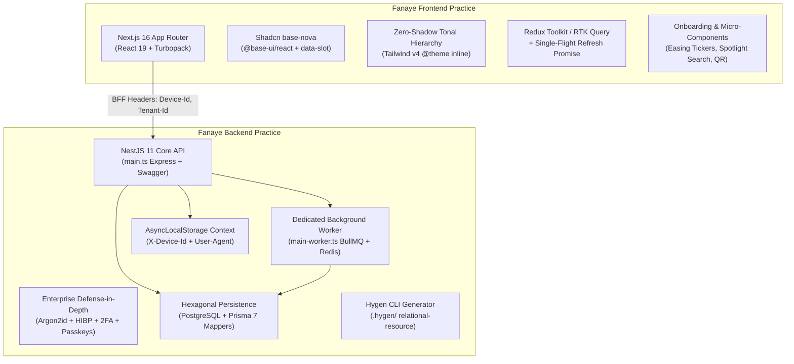

# Company Engineering Practice: Architectural Synthesis of Fanaye Technologies Repositories

**Document**: Cross-Repository Synthesis & Technical Baseline  
**Target Repositories Inspected**:
1. [`fanaye_job_os_platform`](file:///c:/Users/diguw/Desktop/fanaye-tech-boiler-plate/analysis/fanaye_job_os_platform) (TefTef Flagship — Onboarding, Auth Suite, Admin Operations, TanStack Table)
2. [`fin-core`](file:///c:/Users/diguw/Desktop/fanaye-tech-boiler-plate/analysis/fin-core) (Financial Platform — Zero-Shadow Tonal Elevation, Refresh Promise Deduplication, High-Density Analytics)
3. [`modrn-frontend`](file:///c:/Users/diguw/Desktop/fanaye-tech-boiler-plate/analysis/modrn-frontend) (Next.js 16 + React 19 + Shadcn `base-nova` + Tailwind v4 + Container Queries)
4. [`modrn-backend`](file:///c:/Users/diguw/Desktop/fanaye-tech-boiler-plate/analysis/modrn-backend) (NestJS 11 + Prisma 7 + BullMQ + Redis + Argon2id + Passkeys + Hygen)
5. [`nextjs-boilerplate`](file:///c:/Users/diguw/Desktop/fanaye-tech-boiler-plate/analysis/nextjs-boilerplate) (Baseline Frontend Shell — Next.js 16, Redux Toolkit / RTK Query)

---

## 1. Executive Summary: What Fanaye's Codebases Actually Say

Across all audited repositories, Fanaye Technologies' engineering culture demonstrates a clear, mature technical identity:
* **Database & ORM**: Exclusively **PostgreSQL** powered by **Prisma 7** (`@prisma/client` + `@prisma/adapter-pg`), structured under a strict **Hexagonal Architecture** with zero Prisma leakage into business domain models.
* **Frontend Standard**: **Next.js 16 (App Router)** with **React 19**, standardized strictly on modern **Shadcn UI (`base-nova` style with `@base-ui/react`)** and **Tailwind CSS v4**.
* **Visual Philosophy**: Rejection of generic drop shadows in favor of a **Zero-Shadow Tonal Hierarchy** (Sunlit Cream canvas, pure white card bodies with `shadow-none`, surface ivory grouping bars, and 1px hairline borders).
* **Enterprise IAM**: Bank-grade authentication with **Argon2id**, Have I Been Pwned (HIBP) k-anonymity breach verification, **TOTP 2FA**, and **WebAuthn / Passkeys**.
* **Distributed Operations**: Dual-process architecture separating HTTP APIs from background **BullMQ** workers over **Redis**, with clustered **Socket.IO** WebSockets.
* **Domain-Driven Design (DDD)**: Both frontend (`src/domains/<domain>/`) and backend (`src/<domain>/`) are structured as isolated vertical slices.

---

## 2. Pillar-by-Pillar Engineering Synthesis



---

### Pillar 1: Database & Persistence Layer (PostgreSQL + Prisma 7)
* **What the company projects use**: PostgreSQL as the single source of truth, managed via Prisma 7 with the native PostgreSQL driver adapter (`@prisma/adapter-pg`).
* **The Hexagonal Rule**: In `modrn-backend`, domain entities (`domain/<feature>.ts`) contain zero `@prisma/client` decorators or dependencies. An abstract repository (`<feature>.repository.ts`) acts as the port, and a dedicated mapper (`<feature>-prisma.mapper.ts`) translates between database records and domain entities.
* **Schema Governance**:
  - UUIDs for media/files/documents (`@db.Uuid`).
  - Integer primary keys for internal users and relational status lookups.
  - Soft-delete semantics (`deletedAt DateTime?`).
  - Draft snapshots stored as native JSON (`onboardingDraft Json?`) for cross-device resume.
  - Sensitive PII sealed as encrypted ciphertext (`onboardingSsnLast4Ciphertext String?`) before hitting the database.

---

### Pillar 2: Frontend Design System & Shadcn Practice
* **The Shadcn Modernization Mandate**: The company rejects ad-hoc UI kits. UI components strictly adhere to modern Shadcn practices:
  1. **`base-nova` Style**: Uses `@base-ui/react` primitives rather than classic Radix UI, eliminating `asChild` nested button bugs and reducing client bundle sizes.
  2. **`data-slot` Annotations**: Components expose `data-slot="field"`, `data-slot="field-label"`, and `data-slot="field-error"`, enabling high-level styling and container queries.
  3. **Tailwind CSS v4 Native Tokens**: Declared purely in CSS via `@theme inline` with OKLCH dynamic color scales. Zero `--spacing-*` overrides under `@theme`.
* **Zero-Shadow Tonal Hierarchy** (from `fin-core`):
  - Canvas: Warm Sunlit Cream (`#faf9f7`).
  - Cards: Pure White (`#ffffff`) with `shadow-none`.
  - Grouping Bars: Surface Ivory (`#fbfaf7`).
  - Borders: Crisp 1px hairline (`#efefef`).
* **Signature Micro-Components**:
  - `GlobalSearchModal`: Spotlight command palette (`Cmd+K`) with tag filters and shortcut execution.
  - `MembershipQR`: Dynamic QR generator with neon glow bloom shadows.
  - `OnboardingStepper`: Quiet tabular counter (`Profile · 3/6`).
  - `ProfilePreparingWait`: Dynamic easing tabular percentage ticker.
  - `ShareButton`: Native OS share sheet with clipboard toast fallback.
  - `LegalDocument`: Typographic agreement shell.

---

### Pillar 3: Authentication, Security & IAM Architecture
Fanaye applications enforce bank-grade security across the entire user lifecycle:
1. **Password Security**:
   - **Argon2id Hashing**: Uses OWASP-recommended parameters (`memoryCost: 19456, timeCost: 2`).
   - **Transparent Bcrypt Migration**: When legacy users authenticate, `needsRehash` detects legacy bcrypt hashes, validates them, and silently upgrades them to Argon2id in PostgreSQL.
   - **HIBP k-Anonymity Breach Guard**: Queries the Have I Been Pwned API using the 5-character SHA-1 hash prefix. Fails open gracefully during network outages so user registrations are never blocked offline.
   - **Sequence Rule**: Blocks passwords that share 4+ consecutive characters with prior passwords.
   - **Account Lockout**: Automatically locks accounts after 3 consecutive failed attempts for 15 minutes, with email unlock tokens.
2. **Multi-Factor & Biometrics**:
   - TOTP 2FA via authenticator apps (`otplib` + QR code generation) with emergency recovery backup codes.
   - SMS / Phone OTP and magic link login.
   - WebAuthn / Passkeys (`@simplewebauthn/server`) for passwordless biometric login.
3. **Session Management**:
   - Single in-flight refresh promise deduplication (`refreshPromise`) in the frontend network layer to eliminate concurrent 401 refresh logout loops.
   - Multi-device session context (`requestDeviceContext`) using Node.js `AsyncLocalStorage` to record `X-Device-Id` and `User-Agent` across all asynchronous service invocations.

---

### Pillar 4: Asynchronous Processing & Realtime Infrastructure
* **Dual-Process Architecture**:
  - `main.ts`: Express HTTP Web Server (Swagger, CORS, rate limiting, request validation).
  - `main-worker.ts`: Standalone NestJS application context `NestFactory.createApplicationContext(AppModule)` dedicated solely to processing BullMQ background jobs.
* **Email Subsystem**: Resend transactional email driver with Handlebars HTML templates, processed asynchronously via `MailProcessor` (`WorkerHost`).
* **Realtime WebSockets**: Clustered Socket.IO with `@socket.io/redis-adapter` over Redis, featuring automatic cloud TLS detection (AWS ElastiCache) and in-memory fallback.

---

### Pillar 5: Developer Velocity & Code Generation
* **Hygen Relational Resource Generator** (`.hygen/`):
  Enables developers to scaffold a complete, production-ready vertical slice with a single command:
  ```bash
  npm run generate:resource:relational
  ```
  Generates:
  - `domain/<name>.ts` (Domain model)
  - `dto/create-<name>.dto.ts` & `update-<name>.dto.ts` (Validated DTOs)
  - `infrastructure/persistence/<name>.repository.ts` (Abstract repository port)
  - `infrastructure/persistence/relational/mappers/<name>-prisma.mapper.ts` (Two-way mapper)
  - `infrastructure/persistence/relational/repositories/<name>-prisma.repository.ts` (Prisma repository)
  - `<name>.service.ts` & `<name>.controller.ts` (Business service and REST API)
  - `<name>.module.ts` (Dependency injection container)

---

## 3. The Definitive Fanaye Full-Stack Specification

Synthesizing all company projects and global benchmarks, the unified Fanaye Boilerplate will be structured as:

```
fanaye-tech-boiler-plate/
├── frontend/                     # Next.js 16 + React 19 + Shadcn base-nova + Tailwind v4
│   ├── src/
│   │   ├── app/                  # App Router pages, layouts, and route handlers
│   │   ├── domains/              # Vertical business slices (auth, onboarding, admin, financial)
│   │   ├── shared/               # Reusable primitives (ui/, components/, hooks/, utils/)
│   │   └── styles/               # globals.css (OKLCH tokens, Inter typography)
│   ├── components.json           # Shadcn base-nova configuration
│   └── package.json
│
├── backend/                      # NestJS 11 + Prisma 7 + BullMQ + Redis
│   ├── src/
│   │   ├── <domains>/            # Vertical slices (domain/, dto/, infrastructure/, service, controller)
│   │   ├── common/               # AsyncLocalStorage device context, filters, guards, adapters
│   │   ├── queues/               # BullMQ WorkerHost processors (mail, notifications)
│   │   ├── main.ts               # HTTP Web Server
│   │   └── main-worker.ts        # Standalone Background Worker
│   ├── prisma/                   # PostgreSQL schema & migrations
│   ├── .hygen/                   # Relational resource CLI generator
│   └── package.json
│
├── .agents/                      # Living Agentic Skills (Antigravity standard)
│   └── skills/                   # Modular capabilities (create-domain, shadcn-ui, prisma-migration)
├── AGENTS.md                     # Universal AI Agent Briefing
├── docker-compose.yml            # Spins up PostgreSQL, Redis, API, Worker, and Next.js in 1 command
└── memory/                       # Living Memory & Engineering Governance System
```
