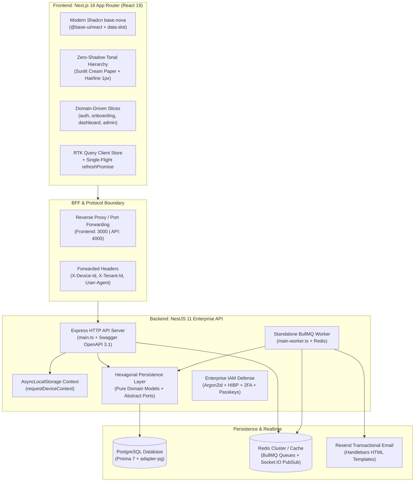

# Master Assembly Blueprint & Implementation Roadmap
## Fanaye Technologies Enterprise Boilerplate (2026 Edition)

**Target Active Branch**: `fanaye-technologies-boiler-plate`  
**Architecture Paradigm**: Dual-Directory Full-Stack Monorepo (`frontend/` + `backend/`)  
**Frontend Stack**: Next.js 16 (App Router) + React 19 + Shadcn `base-nova` (`@base-ui/react`) + Tailwind CSS v4 + Zero-Shadow Tonal Hierarchy + Redux Toolkit / RTK Query  
**Backend Stack**: NestJS 11 + PostgreSQL + Prisma 7 (Hexagonal Architecture) + BullMQ + Redis + Argon2id + WebAuthn/Passkeys + Resend + Socket.IO  
**Agentic Framework**: Root `AGENTS.md` + Antigravity `.agents/skills/` (The Seven Core Fanaye Skills) + Hygen CLI Generators  

---

## 1. Visual Architecture Blueprint



---

## 2. Component Harvest Mapping: Exactly What We Take from Each Analysis Directory

| Source Repository & Directory | Harvested Assets & Subsystems | Boilerplate Integration Target |
| :--- | :--- | :--- |
| **`analysis/nextjs-boilerplate/`**<br/>(Baseline Shell) | • Next.js 16 App Router foundation with React 19 & Turbopack<br/>• Redux Toolkit & RTK Query infrastructure<br/>• Internationalized routing structure (`[locale]/`)<br/>• ESLint 9 & Prettier configurations | `frontend/src/app/`<br/>`frontend/src/store/`<br/>`frontend/src/i18n/` |
| **`analysis/fanaye_job_os_platform/`**<br/>(TefTef Flagship) | • **Production Auth Suite**: `LoginForm`, `RegisterForm`, `ForgotPasswordForm`, `ResetPasswordForm`, `TwoFactorLoginChallenge`, `AuthShell`<br/>• **Onboarding Engine**: `OnboardingShell`, `ProfilePreparingWait` (easing tabular % ticker), `AnimatedGlassPageBackground` (OKLCH radial gradient glow), `MatchScore`<br/>• **Admin Operations**: Generic TanStack `DataTable`, `PaginationControls`, `AdminSidebar`, `PermissionGate` | `frontend/src/domains/auth/`<br/>`frontend/src/domains/onboarding/`<br/>`frontend/src/domains/admin/`<br/>`frontend/src/shared/components/` |
| **`analysis/fin-core/`**<br/>(Financial Flagship) | • **Zero-Shadow Tonal Hierarchy**: Sunlit Cream (`#faf9f7`) canvas, pure-white cards with `shadow-none`, surface ivory (`#fbfaf7`) grouping bars, 1px hairline (`#efefef`) borders<br/>• **High-Density Table**: Multi-search key global filtering, column visibility toggles, dense header rows<br/>• **Financial Analytics**: `DeltaChip` status pills, pure SVG `Sparkline` (zero chart library overhead), Shadcn `ChartContainer` Recharts integration<br/>• **Network Hardening**: Single in-flight `refreshPromise` deduplication & `X-Tenant-Id` injection | `frontend/src/styles/globals.css`<br/>`frontend/src/shared/ui/card.tsx`<br/>`frontend/src/domains/dashboard/`<br/>`frontend/src/core/network/` |
| **`analysis/modrn-frontend/`**<br/>(Modern Frontend Reference) | • **Shadcn `base-nova`**: `@base-ui/react` primitives with `data-slot`<br/>• **DayPicker v10 Calendar**: Dynamic sizing (`size-(--cell-size)`), focus rings, RTL support<br/>• **Container-Query Form System**: `field.tsx` (`FieldSet`, `FieldGroup`, `Field`, `FieldError`) with automatic error deduplication<br/>• **Composite Micro-Components**: `GlobalSearchModal` (Cmd+K Spotlight), `MembershipQR` (Active/Inactive neon glow), `ShareButton` (Native OS sheet + clipboard fallback), `OnboardingStepper`, `LegalDocument`<br/>• **Framer-Spec Typography**: Variable Inter with OpenType features (`ss07`, `cv05`, `ss03`, `cv11`, `cv01`, `cv09`) | `frontend/components.json`<br/>`frontend/src/shared/ui/`<br/>`frontend/src/shared/components/`<br/>`frontend/src/shared/utils/` |
| **`analysis/modrn-backend/`**<br/>(Enterprise Backend Reference) | • **Dual-Process Architecture**: `main.ts` (API Express) + `main-worker.ts` (Standalone BullMQ application context)<br/>• **Async Device Context**: `AsyncLocalStorage` capturing `X-Device-Id` and `User-Agent`<br/>• **Enterprise IAM**: Argon2id hashing with automatic bcrypt runtime migration, Have I Been Pwned k-anonymity check, WebAuthn/Passkeys server<br/>• **Hexagonal Persistence**: Domain entities isolated from Prisma 7; abstract repository ports with dedicated mappers<br/>• **Distributed Systems**: BullMQ `WorkerHost` queue processors, Redis clustered Socket.IO adapter with cloud TLS auto-detection<br/>• **Hygen Generators**: CLI command `hygen generate relational-resource` | `backend/src/main.ts`<br/>`backend/src/main-worker.ts`<br/>`backend/src/common/`<br/>`backend/src/auth/`<br/>`backend/src/database/`<br/>`backend/prisma/`<br/>`backend/.hygen/` |
| **`analysis/global_benchmarks/`**<br/>(2026 AI-Ready Standard) | • Contract Syncing: NestJS `class-validator` ↔ Frontend `zod`<br/>• Resend transactional email driver with Handlebars templates<br/>• Unified multi-service `docker-compose.yml`<br/>• Root script orchestrator (`package.json`) | `docker-compose.yml`<br/>`package.json`<br/>`backend/src/mail/` |
| **`analysis/skills_and_agentic_ecosystem.md`**<br/>(Agentic Framework) | • **The Seven Core Fanaye Skills**: `1-shadcn-base-nova`, `2-zero-shadow-elevation`, `3-create-domain-slice`, `4-hexagonal-persistence`, `5-enterprise-iam-defense`, `6-async-bullmq-worker`, `7-safe-db-migration`<br/>• Universal AI Briefing: Root `AGENTS.md` & `CLAUDE.md`<br/>• Scoped context files: `frontend/AGENTS.md` and `backend/AGENTS.md` | `.agents/skills/`<br/>`AGENTS.md`<br/>`CLAUDE.md`<br/>`frontend/AGENTS.md`<br/>`backend/AGENTS.md` |

---

## 3. Directory Layout of the Assembled Master Monorepo

```
fanaye-tech-boiler-plate/
├── frontend/                                # Next.js 16 + React 19 + Shadcn base-nova
│   ├── public/                              # Brand icons, logo marks, static assets
│   ├── src/
│   │   ├── app/                             # Next.js App Router
│   │   │   ├── [locale]/                    # Multi-language routes (en, am, etc.)
│   │   │   │   ├── (auth)/                  # /login, /register, /forgot-password, /2fa
│   │   │   │   ├── (onboarding)/            # /onboarding multi-step wizard
│   │   │   │   ├── (dashboard)/             # /dashboard, /analytics, /transactions
│   │   │   │   ├── (admin)/                 # /admin/users, /admin/audit-logs
│   │   │   │   ├── layout.tsx               # Root localized layout
│   │   │   │   └── page.tsx                 # Landing / Showcase page
│   │   ├── domains/                         # Domain-Driven Vertical Slices
│   │   │   ├── auth/                        # LoginForm, RegisterForm, TwoFactorChallenge, hooks
│   │   │   ├── onboarding/                  # OnboardingWizard, ProgressTicker, GlassBackground
│   │   │   ├── dashboard/                   # FinancialKPICards, Sparklines, CashflowChart
│   │   │   └── admin/                       # UserManagementTable, AuditTrailTable
│   │   ├── shared/                          # Reusable Primitives & Design System
│   │   │   ├── ui/                          # 25+ Shadcn base-nova primitives (data-slot)
│   │   │   ├── components/                  # GlobalSearchModal, MembershipQR, ShareButton, etc.
│   │   │   └── utils/                       # cn, formatters, share helpers, math
│   │   ├── core/                            # Network client, refreshPromise deduplication
│   │   ├── store/                           # Redux Toolkit / RTK Query API slices
│   │   └── styles/                          # globals.css (OKLCH tokens, Inter typography)
│   ├── components.json                      # Shadcn configuration (base-nova)
│   ├── package.json                         # Frontend dependencies
│   └── AGENTS.md                            # Scoped Frontend Agent Instructions
│
├── backend/                                 # NestJS 11 + Prisma 7 + BullMQ + Redis
│   ├── prisma/
│   │   ├── schema.prisma                    # PostgreSQL schema (Users, Roles, Sessions, Audits)
│   │   ├── migrations/                      # Initial schema migration
│   │   └── seed.ts                          # Production seed script (Admin, Users, Transactions)
│   ├── src/
│   │   ├── auth/                            # Argon2id, HIBP check, 2FA TOTP, Passkeys, JWT
│   │   ├── users/                           # Domain, DTOs, Hexagonal repository, Service, Controller
│   │   ├── session/                         # Multi-device session manager & device context
│   │   ├── dashboard/                       # Financial metrics, sample ledger, transaction records
│   │   ├── mail/                            # Resend email driver + Handlebars HTML templates
│   │   ├── notifications/                   # Clustered Socket.IO Redis WebSockets
│   │   ├── common/                          # AsyncLocalStorage, filters, interceptors, guards
│   │   ├── queues/                          # BullMQ WorkerHost consumers
│   │   ├── main.ts                          # HTTP API Web Server (Swagger at /api/docs)
│   │   └── main-worker.ts                   # Standalone BullMQ Queue Worker
│   ├── .hygen/                              # Relational resource CLI code generator
│   ├── package.json                         # Backend dependencies
│   └── AGENTS.md                            # Scoped Backend Agent Instructions
│
├── .agents/                                 # Antigravity Living Skills Ecosystem
│   └── skills/                              # The Seven Core Fanaye Skills
│       ├── 1-shadcn-base-nova/              # UI primitive rules & data-slot enforcement
│       ├── 2-zero-shadow-elevation/         # Sunlit Cream & hairline elevation rules
│       ├── 3-create-domain-slice/           # Synchronized full-stack DDD scaffolding
│       ├── 4-hexagonal-persistence/         # Prisma 7 decoupling via ports & mappers
│       ├── 5-enterprise-iam-defense/        # Argon2id, HIBP, 2FA & Passkey security
│       ├── 6-async-bullmq-worker/           # BullMQ WorkerHost & Redis queue resilience
│       └── 7-safe-db-migration/             # Zero-data-loss database migration guard
│
├── docker-compose.yml                       # Spins up Postgres, Redis, API, Worker, and Next.js
├── package.json                             # Root orchestrator scripts
├── AGENTS.md                                # Global AI Agent Briefing & Guardrails
├── CLAUDE.md                                # Quick CLI shortcuts for terminal agents
├── README.md                                # Master Developer Onboarding & Architecture Guide
└── memory/                                  # Autonomous Living Memory & Audit Trail
```

---

## 4. Working Sample Data Specification

To ensure the boilerplate is immediately runnable, interactive, and demonstrable out of the box, we will seed working sample records:

1. **Pre-Seeded Roles & Users**:
   * **Super Admin**: `admin@fanaye.com` / `Fanaye@Admin2026!` (Role: `admin`, Status: `active`, 2FA configured)
   * **Demo Developer**: `dev@fanaye.com` / `Fanaye@Dev2026!` (Role: `user`, Status: `active`)
   * **Locked Audit Account**: `locked@fanaye.com` (Simulates 3-attempt account lockout with active unlock token)
2. **Sample Financial Ledger & Analytics** (Demonstrates `fin-core` components):
   * 12 months of cashflow time-series data for the Recharts `ChartContainer`.
   * 5 KPI Metrics: Gross Revenue, Active Subscriptions, Churn Rate, Platform Commission, Operational Margins (with positive/negative `DeltaChip` pills and pure SVG `Sparklines`).
   * 25 mock financial transactions with multi-status filters (Paid, Pending, Overdue, Declined).
3. **Sample Admin & Audit Trail Data** (Demonstrates TefTef components):
   * 20 mock users with avatars, roles, verified badges, and creation dates for TanStack `DataTable` testing (searchable, filterable, sortable, paginated).
   * Security audit logs with captured `deviceId` and `userAgent` metadata.
4. **Sample Onboarding Wizard State**:
   * Multi-step wizard draft snapshot demonstrating the auto-resume flow (`onboardingStep: "verification"`).

---

## 5. Phased, Chunked Implementation Plan

To respect the user's explicit directive—**"you will not build all the boilerplate at once"**—the assembly will be executed sequentially in **8 discrete, verifiable chunks**. Each chunk will compile, verify, update memory, and commit before moving to the next.

```mermaid
graph LR
    C1["Chunk 1:<br/>Monorepo Scaffolding<br/>& Reorganization"] --> C2["Chunk 2:<br/>Backend Core Engine<br/>& Hexagonal Prisma 7"]
    C2 --> C3["Chunk 3:<br/>Enterprise IAM,<br/>BullMQ & Redis"]
    C3 --> C4["Chunk 4:<br/>Frontend Design System<br/>& Shadcn Primitives"]
    C4 --> C5["Chunk 5:<br/>Composite Blocks<br/>(Search, QR, Share)"]
    C5 --> C6["Chunk 6:<br/>Domain Slices &<br/>Sample Data Views"]
    C6 --> C7["Chunk 7:<br/>The 7 Core Agent Skills<br/>& Hygen Generators"]
    C7 --> C8["Chunk 8:<br/>Docker Orchestration,<br/>Verification & README"]
```



---

### Chunk 1: Monorepo Foundation & Workspace Reorganization
* **Action**:
  1. Move the current baseline Next.js frontend files from the repository root into `frontend/`.
  2. Create the `backend/` directory structure with standard NestJS configuration (`nest-cli.json`, `tsconfig.json`, `package.json`).
  3. Create root orchestrator `package.json` with multi-service scripts (`npm run dev`, `npm run build`, `npm run lint`).
  4. Create root `docker-compose.yml` defining PostgreSQL 16 and Redis 7 containers.
  5. Create root `AGENTS.md` and `CLAUDE.md`.
* **Verification**: Verify both `frontend` and `backend` directory paths exist and root package scripts run.

---

### Chunk 2: Backend Core Engine & Hexagonal Prisma 7 Persistence
* **Action**:
  1. Initialize NestJS 11 core (`AppModule`, `main.ts`) in `backend/`.
  2. Configure Prisma 7 schema (`prisma/schema.prisma`) with models: `User`, `Role`, `Status`, `Session`, `File`, `Transaction`, `AuditLog`.
  3. Wire PostgreSQL native driver adapter (`@prisma/adapter-pg`).
  4. Implement Hexagonal repository pattern for `users` and `dashboard` (`domain/`, `dto/`, `infrastructure/persistence/`, `mappers/`).
  5. Write database migration and `seed.ts` containing the sample admin, users, and transactions.
* **Verification**: Run `npm run prisma:generate` and verify TypeScript compiles with zero errors.

---

### Chunk 3: Backend Enterprise IAM, BullMQ Queue Worker & WebSockets
* **Action**:
  1. Implement `AuthModule` with Argon2id password hashing, transparent bcrypt rehash on login, and HIBP k-anonymity breach check.
  2. Implement JWT access/refresh token lifecycle with 401 refresh support.
  3. Configure Node.js `AsyncLocalStorage` (`requestDeviceContext`) to capture `X-Device-Id` and `User-Agent`.
  4. Implement `TOTP 2FA` (`otplib`) and WebAuthn/Passkey registration/authentication (`@simplewebauthn/server`).
  5. Setup `main-worker.ts` standalone application context for BullMQ with `MailProcessor` (`WorkerHost`) and Resend driver.
  6. Implement `RedisIoAdapter` for clustered Socket.IO WebSockets with cloud TLS resilience.
* **Verification**: Run `tsc --noEmit` in `backend/` to verify zero type errors.

---

### Chunk 4: Frontend Design System & Modern Shadcn Primitive Suite
* **Action**:
  1. Configure `frontend/components.json` using the `base-nova` style with `@base-ui/react`.
  2. Implement `frontend/src/styles/globals.css` with Tailwind CSS v4 `@theme inline`, OKLCH dynamic color scales, Framer-spec Inter Variable typography, and the Sunlit Cream Zero-Shadow hierarchy.
  3. Install and wire the core Shadcn UI primitive suite in `frontend/src/shared/ui/`:
     - `button.tsx`, `input.tsx`, `card.tsx` (Zero-shadow body with surface ivory footers)
     - `field.tsx` (Container-query enabled with accessible error deduplication)
     - `status-badge.tsx` (`STATUS_TONE` map with pill styling)
     - `calendar.tsx` (DayPicker v10 with RTL support)
     - `table.tsx`, `dialog.tsx`, `popover.tsx`, `select.tsx`, `sidebar.tsx`, `chart.tsx`, `separator.tsx`, `skeleton.tsx`, `switch.tsx`, `tooltip.tsx`.
* **Verification**: Run `npm run build` or `npm run typecheck` in `frontend/`.

---

### Chunk 5: Frontend Shared Composite Components & Micro-UI
* **Action**:
  1. Implement `GlobalSearchModal` (Cmd+K Spotlight Search with keyboard navigation, catalog fuzzy matching, and quick action shortcuts).
  2. Implement `MembershipQR` (Dynamic QR code generator with active emerald vs inactive red neon halos and modal zoom).
  3. Implement `ShareButton` (Native OS touch share sheet detection with Sonner clipboard toast fallback).
  4. Implement `OnboardingStepper` (Quiet tabular step counter `Profile · 3/6`).
  5. Implement `ProfilePreparingWait` (Easing tabular percentage ticker with glass background radial glow).
  6. Implement `LegalDocument` (Typographic legal agreement viewer).
* **Verification**: Test component imports and ensure zero compile warnings.

---

### Chunk 6: Frontend Domain Slices & Interactive Sample Views
* **Action**:
  1. Wire `core/network/` client with single in-flight `refreshPromise` deduplication and `X-Device-Id` header injection.
  2. Implement `domains/auth/`: Interactive Sign In, Sign Up, 2FA Challenge, and Forgot Password views.
  3. Implement `domains/onboarding/`: Multi-step interactive wizard with radial OKLCH background orbs, easing percentage loader, and progress indicators.
  4. Implement `domains/dashboard/`: Financial command center displaying the sample data:
     - 4 KPI Metric Cards with `DeltaChip` status badges and pure SVG `Sparkline`.
     - Monthly Cashflow Chart using Shadcn `ChartContainer` + Recharts.
     - Recent Transactions DataTable with multi-column search and column visibility toggles.
  5. Implement `domains/admin/`: User Management TanStack `DataTable` with pagination, permission gates, and status pills.
* **Verification**: Start frontend dev server and verify all routes render with sample data.

---

### Chunk 7: The Seven Core Agent Skills & Hygen Generators
* **Action**:
  1. Initialize `.agents/skills/` at the monorepo root.
  2. Author the complete, self-contained `SKILL.md` playbooks for all 7 skills:
     - `1-shadcn-base-nova/SKILL.md`
     - `2-zero-shadow-elevation/SKILL.md`
     - `3-create-domain-slice/SKILL.md`
     - `4-hexagonal-persistence/SKILL.md`
     - `5-enterprise-iam-defense/SKILL.md`
     - `6-async-bullmq-worker/SKILL.md`
     - `7-safe-db-migration/SKILL.md`
  3. Configure `.hygen/` relational resource templates in `backend/` for instant full-stack domain generation.
  4. Author scoped `frontend/AGENTS.md` and `backend/AGENTS.md`.
* **Verification**: Verify all skill directories contain valid YAML frontmatter and markdown instructions.

---

### Chunk 8: Docker Orchestration, End-to-End Verification & Master README
* **Action**:
  1. Complete root `docker-compose.yml` with health checks for PostgreSQL and Redis, and multi-stage Dockerfiles for `frontend` and `backend`.
  2. Author comprehensive root `README.md` covering:
     - Quickstart guide (`docker compose up` / local setup)
     - Demo credentials & sample data overview
     - Architecture overview (Dual-process, Hexagonal persistence, Zero-Shadow UI)
     - How to create a new domain slice via Hygen
     - How AI agents interact with the repository using `.agents/skills/`
  3. Run comprehensive type checks and lints across both frontend and backend (`npm run check-all`).
  4. Log final commit in `memory/edit_log.md` and update `memory/progress_log.md`.
* **Verification**: Execute full end-to-end smoke test verifying clean runs for both frontend and backend.
