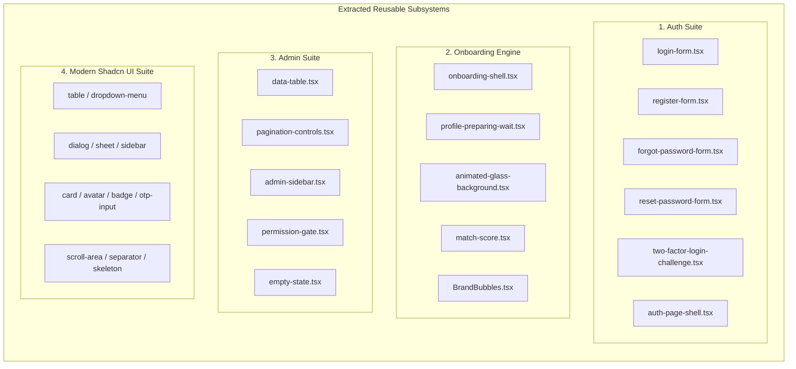

# Architectural Systems Analysis: `fanaye_job_os_platform`

## 1. System Architecture Blueprint

```mermaid
graph TD
    Client[Browser / Mobile Web] --> Edge[Nginx Reverse Proxy / Load Balancer]
    
    subgraph "Frontend Layer (Next.js App Router)"
        Edge --> NextApp[Next.js 15/16 App Router]
        NextApp --> Domains[Domain Architecture: Auth | Admin | Candidate | Billing]
        Domains --> SharedUI[Modern Shadcn UI Suite: 20+ Primitives]
        Domains --> RTK[Redux Toolkit & RTK Query Cache]
    end

    subgraph "Backend Layer (NestJS Modular Core)"
        Edge --> NestCore[NestJS Enterprise API Gateway]
        NestCore --> ModAuth[Auth Module: JWT, 2FA, OTP]
        NestCore --> ModAdmin[Admin Module: RBAC, Audit, User Ops]
        NestCore --> ModJobs[Job & Application Modules]
        NestCore --> ModWorkers[Async Workers & BullMQ Queues]
    end

    subgraph "Persistence & Infrastructure"
        NestCore --> Prisma[Prisma ORM Client]
        Prisma --> Postgres[(PostgreSQL 16 DB)]
        ModWorkers --> Redis[(Redis Cache & BullMQ)]
        NestCore --> S3[(AWS S3 / R2 Object Storage)]
    end
```

---

## 2. Evaluation Against the 10 Enterprise Pillars

| Enterprise Pillar | Implementation in `fanaye_job_os_platform` | Rating | Synthesis Contribution to Boilerplate |
|---|---|---|---|
| **1. Config & Environment Engine** | Type-safe environment validation (`env.config.ts` via Zod) in frontend and backend. | 90% | Direct model for boilerplate environment schema validation. |
| **2. Identity & Access Management (IAM)** | Full lifecycle: Register, Login, Forgot/Reset Password, TOTP 2FA, OTP verification, Granular Permission Gates. | 95% | Harvest complete frontend and backend auth abstractions. |
| **3. Data Persistence & Multi-Tenancy** | PostgreSQL + Prisma ORM with comprehensive migrations, audit fields, and relational models. | 95% | Benchmark schema for base entities, migrations, and seed scripts. |
| **4. API & Transport Layer** | Standardized NestJS DTO validation, global exception filters, Swagger documentation, and RTK Query clients. | 90% | Reference for standardized API envelopes and RTK Query endpoints. |
| **5. Async Workers, Queues & Events** | BullMQ queue processors for background tasks, emails, and batch imports. | 85% | Pattern for background workers and queue configuration. |
| **6. File & Media Storage Subsystem** | S3 presigned upload generation, MIME validation, and secure retrieval pipelines. | 85% | Blueprint for cloud storage adapters. |
| **7. Observability, Telemetry & Logging** | Structured Winston logger with correlation IDs, Microsoft Clarity, and Sentry hooks. | 85% | Logging standards and request tracing interceptor. |
| **8. Enterprise Security Matrix** | Rate limiting, Helmet, strict CORS, OTP brute-force protection, 2FA challenge interception. | 95% | Security guards, permission gates, and password hashing protocols. |
| **9. DevOps, Containerization & CI/CD** | Multi-stage Docker builds, `docker-compose.dev.yaml`, `docker-compose.prod.yaml`, and Nginx config. | 95% | Base containerization and local development compose setup. |
| **10. Frontend / Client SDK Bridge** | Modern Shadcn UI (20+ components), TanStack Table, responsive layouts, OKLCH glassmorphism. | 95% | Core UI components, DataTable, Pagination, and Onboarding engine. |

---

## 3. Component Harvester Architectural Analysis



### Architectural Strengths
1. **Decoupled Admin Data Table Architecture**:
   - `DataTable` abstracts table header sorting, column visibility toggles, dynamic search keys, and custom toolbars into a single declarative component.
   - Pairs seamlessly with `PaginationControls` to support both instantaneous client-side filtering and server-side paginated queries.
2. **Onboarding UX & Visual Hierarchy**:
   - `OnboardingShell` combines animated OKLCH glass gradients with real-time percentage progress.
   - `ProfilePreparingWait` delivers high-retention UX using an easing algorithm (`1 - Math.pow(1 - t, 2.2)`) and tabular font typography that keeps users engaged during long async operations.
3. **Defense-in-Depth Auth Architecture**:
   - Supports seamless transitions between password login, email verification challenges, and 2FA TOTP verification without page refreshes or routing glitches.

---

## 4. Normalization Roadmap for Boilerplate Integration
To integrate these harvested components into the final **Fanaye Technologies Boilerplate**:
1. **Shadcn UI Standardization**: Normalize all component imports from `@/shared/ui/*` to the standard `@/components/ui/*`.
2. **Tailwind v4 Token Compatibility**: Ensure all CSS classes (such as `animate-auth-bg-gradient`, `auth-bg-orb`, glass panel tokens) are integrated into `src/styles/globals.css`.
3. **Independent Composability**: Ensure components (especially `MatchScore`, `ProfilePreparingWait`, and `DataTable`) can be used standalone with clean TypeScript props without hard coupling to project-specific Redux slices.
