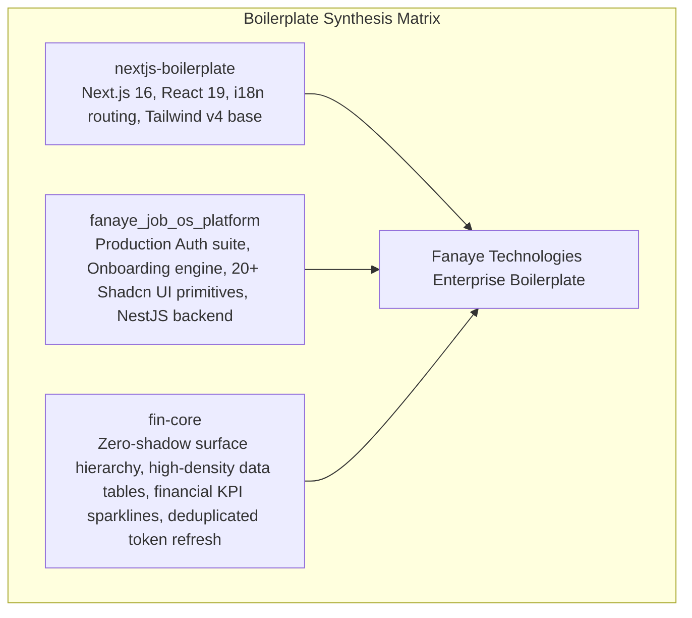

# Architectural Systems Analysis: `fin-core`

## 1. System Architecture Blueprint

```mermaid
graph TD
    Client[Browser / User Agent] --> Ingress[Next.js App Router Ingress]
    
    subgraph "Ingress & Edge Proxy"
        Ingress --> Proxy[src/proxy.ts: Next.js Proxy Middleware]
        Proxy --> PublicCheck{Public Route / API?}
        PublicCheck -- No --> AuthCheck{access_token in cookies?}
        AuthCheck -- No --> Redirect[Redirect to /[locale]/login]
        AuthCheck -- Yes --> AppTree[Locale App Router]
        PublicCheck -- Yes --> AppTree
    end

    subgraph "Design System & UI Layer"
        AppTree --> Theme[Tailwind v4 Dock Theme]
        Theme --> Layer0["Layer 0: Canvas Cream (#faf9f7)"]
        Theme --> Layer1["Layer 1: Surface Ivory (#fbfaf7)"]
        Theme --> Layer2["Layer 2: Pure White (#ffffff)"]
        Theme --> Layer3["Layer 3: Hairline Border (#efefef)"]
        
        Layer2 --> ZeroShadowCard["Card.tsx (shadow-none)"]
        Layer2 --> HighDensityTable["DataTable.tsx (bg-surface-ivory header)"]
        Layer2 --> FinancialCharts["Recharts ChartContainer + Sparkline"]
    end

    subgraph "Client Core & State Management"
        AppTree --> ReduxStore[Redux Toolkit Store]
        ReduxStore --> BaseQuery[baseQueryWithInterceptor]
        BaseQuery --> InFlightRefresh["refreshAccessToken() Deduplicator"]
        BaseQuery --> TenantHeader["X-Tenant-Id Propagation"]
    end
```

---

## 2. Evaluation Against the 10 Enterprise Pillars

| Enterprise Pillar | Implementation in `fin-core` | Rating | Synthesis Contribution to Boilerplate |
|---|---|---|---|
| **1. Config & Environment Engine** | Type-safe environment validation (`env.config.ts`), demo accounts configuration. | 90% | Demo account fallback pattern for rapid prototyping. |
| **2. Identity & Access Management (IAM)** | Token storage, deduplicated refresh session (`refreshPromise`), cookie sync, fine-grained `can()` permissions. | 95% | **Deduplicated refresh token promise**: Completely resolves race conditions during token refresh. |
| **3. Data Persistence & Multi-Tenancy** | Client-side tenant awareness via `activeTenantId` propagated in all API headers (`X-Tenant-Id`). | 90% | Header-driven multi-tenancy propagation pattern. |
| **4. API & Transport Layer** | RTK Query with automatic token refresh, tenant injection, and unified error handling. | 95% | Blueprint for boilerplate's core API client. |
| **5. Async Workers, Queues & Events** | Client-side async handling with boundary fallbacks (`async-boundary.tsx`). | 80% | UI async boundary handling patterns. |
| **6. File & Media Storage Subsystem** | PDF first-page extraction via `pdfjs-dist`, receipt scanning UI. | 90% | In-browser document preview component. |
| **7. Observability, Telemetry & Logging** | Environment-aware logger abstraction (`dev-logger.ts` vs `prod-logger.ts`). | 85% | Clean logging boundary separating dev vs prod telemetry. |
| **8. Enterprise Security Matrix** | Proxy-level authentication gate, refresh token single-use protection, role switcher with permission check. | 95% | Defense-in-depth routing proxy. |
| **9. DevOps, Containerization & CI/CD** | Multi-stage `Dockerfile.prod`, `Dockerfile.dev`, `docker-compose.dev.yml`, `docker-compose.prod.yml`. | 95% | Production Next.js 16 containerization setup. |
| **10. Frontend / Client SDK Bridge** | Zero-shadow border-led design tokens, high-density data tables, Recharts ChartContainer, pure SVG sparklines. | 100% | **Master design system benchmark**: Sunlit cream paper + cobalt pulse tokens, hairline borders, zero shadows. |

---

## 3. Core Architectural Synergies for Final Boilerplate

By synthesizing `fin-core` with our previously analyzed repositories (`AbrshS/nextjs-boilerplate` and `fanaye_job_os_platform`), we achieve a complete, elite architecture:



### 1. Visual Design Synthesis
- Adopt `fin-core`'s **Zero-Shadow Tonal Hierarchy**:
  - Background: `--color-canvas-cream` (`#faf9f7`)
  - Elevated Cards: `--color-pure-white` (`#ffffff`) with `shadow-none`
  - Grouping/Headers: `--color-surface-ivory` (`#fbfaf7`)
  - Dividers: `--color-hairline` (`#efefef`) 1px crisp separation
  - Action Pulse: `--color-electric-cobalt` (`#0068f9`) with 48px pill radius

### 2. Table & Dashboard Synthesis
- Pair `fanaye_job_os_platform`'s robust `PaginationControls` with `fin-core`'s multi-search key `DataTable` and `bg-surface-ivory/80` headers.
- Include `fin-core`'s pure SVG `Sparkline` and `DeltaChip` inside KPI cards for rich data visualization.

### 3. Auth & Network Synthesis
- Incorporate `fin-core`'s `refreshAccessToken` single in-flight promise deduplication to prevent 401 refresh storms across concurrent requests.
- Retain `fanaye_job_os_platform`'s full auth UI (login, register, forgot/reset password, 2FA challenge).
