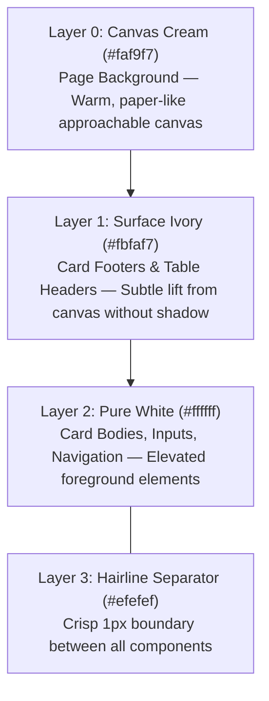

# Fin-Core Deep Analysis: Financial Architecture & Zero-Shadow UI/UX

## 1. Repository Metadata & Executive Scope
- **Source Repository**: `https://github.com/aynuayex/fin-core`
- **Analysis Date**: 2026-10-01
- **Tech Stack**: Next.js 16.2.6 (App Router), React 19.2.4, Tailwind CSS v4.3.3, Redux Toolkit 2.11.2, Recharts 3.8.0, TanStack Table 8.21.3, Shadcn 4.19.0, Motion 13.1.1
- **Architectural Role**: Benchmark for Enterprise Financial Systems, High-Density Dashboards, and Zero-Shadow Border-Led UI/UX.

---

## 2. Iconic UI/UX Pattern: The Zero-Shadow Tonal Hierarchy

The defining characteristic of `fin-core` is its **elimination of heavy, muddy box shadows in favor of a crisp, border-led tonal hierarchy** (inspired by the "Dock" design system: *Sunlit Cream Paper, Cobalt Pulse*).

### The 4-Layer Surface Hierarchy (Contrast Pattern)



| Layer Token | Hex Value | Semantic Role in Fin-Core | Optical Contrast Principle |
|---|---|---|---|
| `--color-canvas-cream` | `#faf9f7` | Entire page canvas / background | Replaces stark `#ffffff` with a warm, editorial paper texture that prevents eye fatigue. |
| `--color-surface-ivory` | `#fbfaf7` | Table headers (`bg-surface-ivory/80`), card footers | One step brighter than canvas; establishes visual grouping without blur or drop-shadows. |
| `--color-pure-white` | `#ffffff` | Card bodies, inputs, nav bar, data table container | Pure elevated foreground surface where data is read. |
| `--color-hairline` | `#efefef` | 1px border on cards, tables, dividers | Ultra-crisp, featherlight boundary preventing elements from bleeding together. |
| `--color-lavender-mist`| `#f4f0ff` | Decorative wash behind badges/icons | Cool counterpoint to the warm cream canvas. |
| `--color-electric-cobalt`| `#0068f9` | Primary interactive color (buttons, active tabs) | High-energy pulse reserved strictly for interactive actions. |

---

## 3. Component Deep Dive: Line-by-Line Patterns

### Pattern A: Zero-Shadow Card Architecture (`card.tsx`)
```tsx
// Dock Card Pattern: 16px radius, soft hairline only — no shadow
<div
  className="group/card flex flex-col gap-4 overflow-hidden rounded-[var(--radius-cards)] 
             border border-hairline bg-pure-white py-6 text-sm text-card-foreground shadow-none"
>
  <CardHeader className="px-6" />
  <CardContent className="px-6" />
  <CardFooter className="rounded-b-[var(--radius-cards)] border-t border-hairline bg-surface-ivory p-6" />
</div>
```
- **Key Insight**: The card body is `bg-pure-white`, while the footer transitions to `bg-surface-ivory` with a `border-t border-hairline`. This subtle contrast anchors the card actions without needing any `box-shadow`.

### Pattern B: High-Density Financial Data Table (`data-table.tsx`)
```tsx
<div className="max-w-full min-w-0 overflow-x-auto rounded-[var(--radius-cards)] border border-hairline bg-pure-white">
  <Table>
    <TableHeader>
      <TableRow className="border-hairline hover:bg-transparent">
        <TableHead className="h-11 bg-surface-ivory/80 px-4 text-[12px] font-semibold tracking-[0.02em] text-slate-gray">
          {/* Header Label + ChevronsUpDownIcon */}
        </TableHead>
      </TableRow>
    </TableHeader>
    <TableBody>
      <TableRow className="border-hairline hover:bg-muted/50">
        <TableCell className="px-4 py-3 text-[13px]">{/* Cell Value */}</TableCell>
      </TableRow>
    </TableBody>
  </Table>
</div>
```
- **Key Insight**:
  - The table container uses `rounded-[16px]` and `border border-hairline bg-pure-white`.
  - The table header row is tinted with `bg-surface-ivory/80` and uses `text-slate-gray text-[12px] uppercase/tracking-[0.02em]`.
  - Multi-key global search (`multiSearchKeys`) filters across multiple column accessors simultaneously.

### Pattern C: Financial KPI Cards & Real-Time Sparklines (`kpi-cards.tsx` & `sparkline.tsx`)
- **`DeltaChip`**: Semantic percentage badge using low-opacity alpha fills:
  - Positive trend: `bg-[#5ecf9a]/15 text-[#2f9e6e]`
  - Negative trend: `bg-[#f07167]/15 text-[#d94a40]`
  - Flat trend: `bg-surface-ivory text-slate-gray`
- **`Sparkline`**: 100% pure SVG vector math calculating polyline coordinates on-the-fly (`M x,y L x,y`) with 0 external chart dependencies. Blazing fast, zero memory leaks.

### Pattern D: Modern Shadcn Recharts Integration (`chart.tsx` & `dashboard-charts.tsx`)
- Encapsulates Recharts primitives inside `ChartContainer` with CSS variable color bindings.
- Uses `Panel` wrappers with `border border-hairline bg-pure-white p-5 shadow-none`.

---

## 4. Critical Engineering Gotchas Uncovered

### Gotcha 1: Tailwind v4 Spacing Injection Hazard
In `fin-core/src/app/globals.css`, the engineers documented a critical bug:
```css
/*
 * DO NOT put --spacing-N in @theme.
 * Tailwind v4 maps --spacing-* to utilities (p-8, h-8, size-8, gap-8…).
 * Defining --spacing-8: 8px here crushed every h-8/size-8 to 8px and
 * broke the shadcn sidebar (row height, icons, avatars, gaps).
 * Dock spacing lives in :root below as plain CSS variables.
 */
```
- **Impact**: In Tailwind v4, `@theme` variables named `--spacing-*` override core utility size calculations. This must be avoided in the Fanaye boilerplate.

### Gotcha 2: Concurrency in Refresh Tokens (`refresh-session.ts`)
Single-use refresh tokens trigger race conditions when multiple parallel HTTP requests fail simultaneously with 401s.
- `fin-core` solves this by sharing a single module-level promise:
  ```typescript
  let refreshPromise: Promise<boolean> | null = null;
  export function refreshAccessToken(dispatch) {
    if (!refreshPromise) {
      refreshPromise = performRefresh(dispatch).finally(() => { refreshPromise = null; });
    }
    return refreshPromise;
  }
  ```
- All concurrent callers await the exact same in-flight refresh request, preventing invalidation errors.

---

## 5. Extracted Assets Inventory

The extracted assets are cataloged in [`analysis/fin-core/extracted_components/`](file:///c:/Users/diguw/Desktop/fanaye-tech-boiler-plate/analysis/fin-core/extracted_components):
- **`design_system/`**: `DESIGN (2).md`, `theme (2).css`, `tokens (2).json`, `globals.css`
- **`ui/`**: `card.tsx` (zero shadow), `chart.tsx`, `table.tsx`, `breadcrumb.tsx`, `alert.tsx`
- **`tables/`**: `data-table.tsx` (multi-key search, column visibility, surface ivory header)
- **`dashboard/`**: `kpi-cards.tsx`, `sparkline.tsx`, `dashboard-charts.tsx`, `cashflow-dashboard-view.tsx`, `chart-palette.ts`, `format-etb.ts`
- **`core/`**: `refresh-session.ts` (promise deduplication), `base-api.ts` (multi-tenancy `X-Tenant-Id`), `can.ts` (permission logic)
