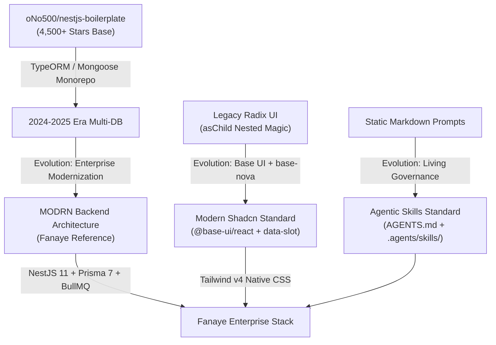

# Global Benchmark Analysis: Enterprise Boilerplates & AI-Agent Architectures

**Analysis Date**: October 2026  
**Context**: Research benchmark for Fanaye Technologies Enterprise Boilerplate evolution  
**Primary References**: 
- `oNo500/nestjs-boilerplate` (GitHub's #1 starred enterprise NestJS starter)
- 2026 Dev.to Engineering Standard: *"An AI-Ready NestJS + Next.js Boilerplate for 2026"*
- Modern Shadcn `base-nova` & `@base-ui/react` specification
- Antigravity / Cursor / Claude Code `AGENTS.md` & Agentic Skills open standard

---

## 1. Global Benchmark Landscape & Evolutionary Lineage



### 1.1. The `oNo500/nestjs-boilerplate` Pedigree
Globally, when engineers look for a production-hardened NestJS template, `oNo500/nestjs-boilerplate` is the benchmark:
* **Strengths**: Strict feature-module boundaries, clean separation between domain logic and persistence, comprehensive authentication controllers, and automated code generation via **Hygen** (`.hygen/`).
* **Limitations in its Vanilla Form**: Relies on TypeORM (which suffers from complex relation typing and eager-loading footguns) or Mongoose, uses legacy ESLint configs, and lacks modern passkey / biometric IAM.
* **The Fanaye Advantage**: As uncovered in our Phase 3 inspection, the company's reference project `modrn-backend` already accomplished the hard work of modernizing `oNo500`'s core:
  1. Swapped TypeORM for **Prisma 7** (`@prisma/client: ^7.7.0` + `@prisma/adapter-pg`).
  2. Added **BullMQ** for background job queues.
  3. Integrated **Argon2id** password hashing with automatic transparent migration from legacy bcrypt.
  4. Added **WebAuthn / Passkeys** (`@simplewebauthn/server`).
  5. Implemented **`AsyncLocalStorage`** for thread-local client device tracking.

---

## 2. Modern Frontend & Shadcn UI Practices (2026 Standard)

### 2.1. The Shift to `base-nova` & `@base-ui/react`
The 2026 global benchmark explicitly moves away from classic Radix UI towards Base UI (`@base-ui/react`):
* **No `asChild` Render Glitches**: Radix's `asChild` prop frequently caused silent `<button><button>` nesting bugs when AI agents or developers missed the prop. Base UI uses an explicit `render` prop (`<Button render={<a href="/..." />}>`) and standard DOM elements.
* **`data-slot` Styling Engine**: Every primitive exposes semantic slots (`data-slot="field"`, `data-slot="field-label"`, `data-slot="card-content"`). Parent layouts can style children using clean Tailwind v4 child selectors:
  ```css
  group-has-data-horizontal/field:text-balance
  *:data-[slot=field-label]:flex-auto
  ```
* **Lighter Bundle & Headless Accessibility**: Zero runtime CSS injection; 100% compiled at build time by Tailwind CSS v4.

### 2.2. Tailwind CSS v4 Native Tokens (`@theme inline`)
* Eliminates `tailwind.config.js` completely.
* Custom theme tokens are declared inside `globals.css` with `@theme inline`.
* **Critical Global Gotcha**: Never inject custom `--spacing-*` tokens under `@theme`, as doing so destroys standard Tailwind utilities (`h-8`, `w-8`, `size-4`) across all Shadcn components. Custom spacing must live strictly under `:root`.

### 2.3. Container-Query Enabled Form Fields
Modern UI design rejects viewport-only breakpoints (`md:`, `lg:`) for form layouts. Using container queries (`@container/field-group`):
* Inside a narrow sidebar or modal sheet: fields automatically stack vertically.
* Inside a wide main canvas: fields automatically expand into side-by-side labels and multi-column inputs without manual layout flags.

---

## 3. Communications, Realtime & Background Infrastructure

### 3.1. Email Subsystem: Resend + BullMQ Asynchronous Queues
* **Why Resend**: Industry-standard deliverability, clean REST API, and native support for React/HTML email components.
* **The Asynchronous Rule**: Never send emails synchronously inside an HTTP request handler. Network timeouts or SMTP delays degrade API throughput.
* **The Pattern**:
  ```typescript
  // 1. Controller queues the job (latency < 5ms)
  await this.mailQueue.add('send', { to, subject, template, context });

  // 2. Dedicated background worker consumes the job
  @Processor('mail')
  export class MailProcessor extends WorkerHost {
    async process(job: Job) {
      await this.mailerService.sendMail(job.data);
    }
  }
  ```

### 3.2. Clustered WebSockets with Redis Adapter
* **Problem**: Standard Socket.IO stores sockets in-memory. If a system scales horizontally to 3 server pods, clients connected to Pod A cannot receive messages broadcast from Pod B.
* **Global Standard**: `@socket.io/redis-adapter` with dual `ioredis` instances (Pub and Sub).
* **Cloud Resilience**: Automatic detection of AWS ElastiCache TLS handshakes, graceful handling of unsupported cloud Redis commands (`psubscribe`), and automatic fallback to an in-memory adapter if Redis disconnects, preventing container crash loops.

---

## 4. Agentic Governance: Structuring AI-Ready Boilerplates

In high-performing 2025/2026 codebases, AI coding assistants (Antigravity, Cursor, Claude Code, Windsurf, Copilot) are treated as first-class team members with structured guidance systems:

```
├── AGENTS.md                  # Global AI Briefing: commands, architecture, guardrails
├── CLAUDE.md                  # Quick CLI commands & lint rules for CLI agents
├── .agents/                   # Antigravity Skills & Capabilities
│   └── skills/
│       ├── create-domain/     # Skill: How to scaffold a new business domain
│       │   ├── SKILL.md       # YAML frontmatter + prompt guidelines
│       │   └── template/      # Reference domain templates
│       ├── shadcn-ui/         # Skill: Rules for generating Base UI components
│       │   └── SKILL.md
│       └── prisma-migration/  # Skill: Safe migration & zero-data-loss workflow
│           └── SKILL.md
├── frontend/
│   └── AGENTS.md              # Scoped Frontend Briefing (Next.js, Base UI, RTK)
└── backend/
    └── AGENTS.md              # Scoped Backend Briefing (NestJS, Prisma 7, BullMQ)
```

### 4.1. The Role of `AGENTS.md`
* Acts as the "README for AI".
* Read automatically upon conversation initialization.
* Declares:
  1. **Strict Guardrails**: *"Never touch database migrations without confirmation. Never use any."*
  2. **Project Map**: Directory structure and vertical slice boundaries.
  3. **Verification Commands**: Exact commands to run after making changes (`npm run type-check`, `npm run lint`).

### 4.2. The Role of Modular Skills (`SKILL.md`)
* Instead of stuffing 5,000 lines of instructions into a single prompt, **Skills** load on-demand when relevant to the active task.
* Structured with standard YAML frontmatter:
  ```yaml
  ---
  name: create-domain
  description: Scaffolds a new vertical domain slice across frontend and backend.
  ---
  ```
* Ensures AI agents generate consistent domain entities, DTOs, mappers, repositories, and UI views across different engineering sessions.

---

## 5. Architectural Checklist for the Fanaye Boilerplate

Based on the global benchmark survey, the Fanaye boilerplate should strictly adopt:
- [x] **Dual-Directory Monorepo**: `frontend/` (Next.js 16) + `backend/` (NestJS 11) + root `docker-compose.yml`.
- [x] **Shadcn `base-nova`**: `@base-ui/react` primitives + `data-slot` + Tailwind v4 `@theme inline`.
- [x] **Hexagonal Persistence**: Domain entities isolated from Prisma models via pure mappers.
- [x] **Dual-Process Backend**: `main.ts` (API Web Server) and `main-worker.ts` (BullMQ Queue Worker).
- [x] **Bank-Grade IAM**: Argon2id + HIBP breach check + 2FA TOTP + Passkeys.
- [x] **Async Context**: Node.js `AsyncLocalStorage` for client device fingerprinting (`X-Device-Id`).
- [x] **Agentic Governance**: Root `AGENTS.md` + Antigravity `.agents/skills/` suite.
