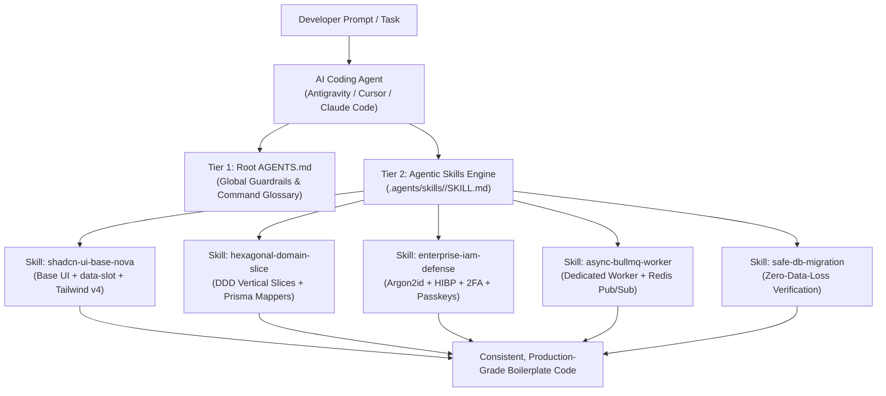

# Deep Analysis: AI Agent Skills Ecosystem & Fanaye Governance Suite

**Analysis Date**: October 2026  
**Context**: Research into the global AI Agent Skills ecosystem and formulation of the Fanaye Technologies Agentic Skills Suite  
**Primary Registries & References**:
- [Skills.sh](https://skills.sh/) (Vercel Labs official Agent Skills directory)
- [AgenticSkills.io](https://agenticskills.io/) (Community skills directory & toolkits)
- [VoltAgent/awesome-agent-skills](https://github.com/VoltAgent/awesome-agent-skills) (Curated library of 1,000+ agent skills)
- [finfin/awesome-frontend-skills](https://github.com/finfin/awesome-frontend-skills) (Frontend-specific `SKILL.md` directory across 12 categories)
- [jakubkrehel/skills](https://github.com/jakubkrehel/skills) (Interface design, typography, accessibility, and color systems)
- Open Agent Skills Standard (`npx skills`, Antigravity, Claude Code, Cursor, Windsurf)

---

## 1. The Global Agent Skills Ecosystem: Architecture & Mechanics



### 1.1. How Skills Actually Work (The Open `SKILL.md` Standard)
Unlike heavy agent extensions that require proprietary runtimes, modern Agent Skills follow a tool-agnostic open standard:
1. **Directory Structure**: A skill is simply a directory containing a `SKILL.md` file:
   ```
   .agents/skills/<skill-name>/
   ├── SKILL.md          # Required: YAML frontmatter + detailed markdown instructions
   ├── scripts/          # Optional: Executable validation scripts or scaffolding helpers
   └── references/       # Optional: Architecture diagrams, schemas, or design tokens
   ```
2. **YAML Frontmatter (On-Demand Activation)**:
   ```yaml
   ---
   name: shadcn-ui-base-nova
   description: Enforces modern Shadcn base-nova UI primitive creation with @base-ui/react, data-slot, and Tailwind CSS v4.
   ---
   ```
   The agent scans the frontmatter descriptions at startup. When a developer asks to build a form or create a button, the agent loads *only* that specific skill into context, eliminating context window bloat.
3. **Universal Interoperability**: Compatible out of the box with **Antigravity**, **Cursor** (via `.cursor/rules/`), **Claude Code** (via `CLAUDE.md` and `.claude/skills/`), and the `npx skills` CLI.

---

## 2. In-Depth Audit of Global Repositories & Top-Trending Skills

### 2.1. UI, UX & Design System Skills
* **`jakubkrehel/skills`**:
  - `better-ui`: Polish guidelines covering concentric border radius, optical alignment, hit areas, and micro-animations.
  - `better-typography`: Strict type scale, line-height ratios, variable font tuning, and OpenType feature activation (directly validates Fanaye's Inter Variable Framer-spec typography).
  - `better-colors`: Palette generation, contrast ratios, and modern OKLCH format conversion.
  - `better-accessibility`: WCAG 2.1 AA compliance, focus rings, and screen reader announcements.
* **`finfin/awesome-frontend-skills`**:
  - 70+ modular skills covering Next.js 16 App Router, Tailwind v4 native styles, Shadcn UI patterns, and Playwright end-to-end testing.
* **`skills.sh` Community Leaders**:
  - `shadcn-ui/ui` (80,000+ installs): Source-code injection patterns for component primitives.
  - `pproenca/dot-skills` (Tailwind CSS v4 Best Practices): Enforces CSS-first `@theme` configuration and avoids spacing scale collisions.

### 2.2. Backend, Persistence & Distributed Systems Skills
* **`api-database-redis` (`skills.sh`)**:
  - Critical redis configuration standards: Mandates `maxRetriesPerRequest: null` for BullMQ queue workers, separate client connections for Pub/Sub subscribers, and connection retry exponential backoffs.
* **`prisma-driver-adapter-implementation` & `prisma-cli`**:
  - Direct guidance for implementing `@prisma/adapter-pg` driver adapters, connection pooling, and non-destructive schema migrations.
* **`nestjs-architecture-principles` & `nestjs-modular-monolith`**:
  - Guidance on strict dependency inversion, domain service isolation, and clean controller contracts.

### 2.3. Security & IAM Skills
* **`audit-security` (`skills.sh`) & `find-bugs` (`agenticskills.io`)**:
  - Static OWASP review checklist for injection flaws, authentication boundaries, and cryptographic parameters.
* **`better-auth` & Hardware Security Key Authentication**:
  - WebAuthn / FIDO2 relying party implementation, session token hashing, and RBAC permission gates.

---

## 3. The Curated Fanaye Agent Skills Suite

To ensure engineers and AI assistants working on Fanaye projects never violate company practices, we define a dedicated suite of **7 Core Skills** to be packaged inside `.agents/skills/`:

```
.agents/skills/
├── 1-shadcn-base-nova/        # Modern Shadcn UI primitives with Base UI & data-slot
├── 2-zero-shadow-elevation/   # Sunlit Cream & hairline border aesthetic
├── 3-create-domain-slice/     # Full-stack DDD vertical slice scaffolding
├── 4-hexagonal-persistence/   # Prisma 7 decoupling via pure domain mappers
├── 5-enterprise-iam-defense/  # Argon2id, HIBP breach check, 2FA, Passkeys
├── 6-async-bullmq-worker/     # Background queue processing & Redis resilience
└── 7-safe-db-migration/       # Accidental data-loss prevention & migration rules
```

---

### Skill 1: `shadcn-base-nova` (`.agents/skills/1-shadcn-base-nova/SKILL.md`)
* **Objective**: Enforce modern 2026 Shadcn component practices.
* **Core Rules**:
  1. Never use classic Radix UI `asChild`. Use `@base-ui/react` with the explicit `render` prop.
  2. Every interactive primitive must expose `data-slot` attributes (`data-slot="field"`, `data-slot="field-label"`, `data-slot="card-content"`).
  3. Form composition must use the container-query enabled `Field` system (`FieldSet`, `FieldGroup`, `Field`, `FieldError`) for automatic responsiveness across modals and sidebars.
  4. DayPicker integration must use DayPicker v10 with `getDefaultClassNames()` and RTL support.

---

### Skill 2: `zero-shadow-elevation` (`.agents/skills/2-zero-shadow-elevation/SKILL.md`)
* **Objective**: Enforce Fanaye's signature visual hierarchy (harvested from `fin-core`).
* **Core Rules**:
  1. **Strictly prohibit heavy box shadows** (`shadow-md`, `shadow-lg`, `shadow-xl`) on data grids and dashboard cards.
  2. Use the **Sunlit Cream Paper** palette:
     - Background canvas: Warm cream (`#faf9f7`).
     - Card body: Pure white (`#ffffff`) with `shadow-none`.
     - Grouping bars (table headers, card footers): Surface ivory (`#fbfaf7`).
     - Elevation borders: Crisp 1px hairline (`#efefef`).
  3. Status indicators must use light tint background pills (`DeltaChip` style) rather than harsh solid fills.

---

### Skill 3: `create-domain-slice` (`.agents/skills/3-create-domain-slice/SKILL.md`)
* **Objective**: Automate scaffolding of synchronized vertical slices across frontend and backend.
* **Core Rules**:
  1. **Frontend**: Creates `frontend/src/domains/<domain>/` with isolated components, hooks, and types.
  2. **Backend**: Invokes `hygen generate relational-resource` to scaffold:
     - `domain/<domain>.ts` (Domain model)
     - `dto/create-<domain>.dto.ts` & `update-<domain>.dto.ts` (Class-validator contracts)
     - `infrastructure/persistence/<domain>.repository.ts` (Abstract port)
     - `infrastructure/persistence/relational/mappers/<domain>-prisma.mapper.ts` (Two-way mapper)
     - `infrastructure/persistence/relational/repositories/<domain>-prisma.repository.ts` (Prisma repository)
     - `<domain>.service.ts` & `<domain>.controller.ts` (REST endpoints with Swagger)
     - `<domain>.module.ts` (DI wiring)
  3. **Verification**: Compiles both sides to verify zero TypeScript errors.

---

### Skill 4: `hexagonal-persistence` (`.agents/skills/4-hexagonal-persistence/SKILL.md`)
* **Objective**: Prevent database coupling from leaking into business logic.
* **Core Rules**:
  1. Domain entities (`domain/*.ts`) must never import `@prisma/client`.
  2. Application services must depend strictly on abstract repository interfaces (`<name>.repository.ts`), never on `PrismaService` directly.
  3. All database record translations must occur within `mappers/*-prisma.mapper.ts`.

---

### Skill 5: `enterprise-iam-defense` (`.agents/skills/5-enterprise-iam-defense/SKILL.md`)
* **Objective**: Enforce bank-grade security across authentication flows.
* **Core Rules**:
  1. Password hashing must use **Argon2id** (`memoryCost: 19456, timeCost: 2`).
  2. Legacy bcrypt hashes must be automatically detected on login (`needsRehash`) and upgraded in PostgreSQL.
  3. Have I Been Pwned (HIBP) k-anonymity breach verification must run on registration and password changes, with network fail-open.
  4. Passwords must pass the 4-character sequence similarity rule.
  5. Multi-factor authentication must support TOTP authenticator apps and native WebAuthn/Passkeys.
  6. Frontend client requests must use single in-flight `refreshPromise` deduplication to prevent 401 logout storms.

---

### Skill 6: `async-bullmq-worker` (`.agents/skills/6-async-bullmq-worker/SKILL.md`)
* **Objective**: Enforce dual-process decoupling and distributed queue reliability.
* **Core Rules**:
  1. Long-running or IO-heavy operations (emails, PDFs, verification webhooks) must be pushed to BullMQ queues, never processed inside HTTP request handlers.
  2. Queue consumers must extend `WorkerHost` and run inside `main-worker.ts`.
  3. Redis connections for BullMQ must set `maxRetriesPerRequest: null`.
  4. Realtime events must use the Redis Pub/Sub Socket.IO adapter with cloud TLS auto-detection and in-memory fallback.

---

### Skill 7: `safe-db-migration` (`.agents/skills/7-safe-db-migration/SKILL.md`)
* **Objective**: Prevent accidental data loss during schema evolution.
* **Core Rules**:
  1. Stop and verify before running any migration containing `DROP TABLE`, `DROP COLUMN`, or `TRUNCATE`.
  2. For destructive column renames, follow the expand-and-contract pattern (add new column, sync data, deprecate old column).
  3. Always verify Prisma migrations against a local shadow database before deploying to staging/production.

---

## 4. Integration Strategy for the Master Boilerplate

During **Phase 5 (Synthesis & Assembly)**:
1. Initialize the `.agents/skills/` directory at the project root.
2. Author all 7 `SKILL.md` specification files with clear YAML frontmatter and actionable instructions.
3. Wire the root `AGENTS.md` and `CLAUDE.md` to reference these skills so any AI agent instantly adheres to Fanaye Technologies' engineering standards.
