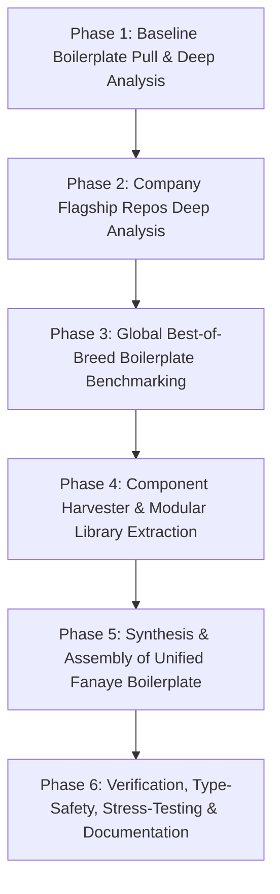
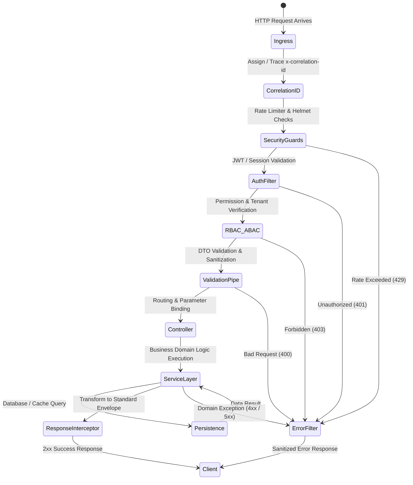

# Master Architecture: Fanaye Technologies Enterprise Boilerplate

## 1. Executive Summary & Mission
**Fanaye Technologies Enterprise Boilerplate** is the foundational, production-grade template designed to accelerate project delivery across all company initiatives. 

### Core Mandate (CTO Directive)
> *"When a new project starts, we should not build everything and every architecture from scratch."*

The boilerplate must deliver a unified, highly modular, scalable, and secure architecture that encapsulates company-tested patterns, battle-hardened abstractions, and global best practices.

---

## 2. Multi-Phase Architectural Strategy



### Analysis Directory Protocol
For each repository analyzed:
```
analysis/
├── <repo_name>/
│   ├── <repo_name>_analysis.md    # Architecture, patterns, dependencies & audit
│   ├── arch_analysis.md           # System design, data flow, modular boundaries
│   └── extracted_components/      # Curated, reusable modules extracted for boilerplate
```

---

## 3. Core Architectural Modules

The unified boilerplate architecture is structured into 10 decoupled, pluggable pillars:

```mermaid
graph LR
    subgraph "Core Enterprise Pillars"
        P1[1. Config & Environment Engine]
        P2[2. Identity & Access Management (IAM)]
        P3[3. Data Persistence & Multi-Tenancy]
        P4[4. API Gateway & Transport Layer]
        P5[5. Async Workers, Queues & Events]
        P6[6. File & Media Storage Subsystem]
        P7[7. Telemetry, APM & Observability]
        P8[8. Enterprise Security Matrix]
        P9[9. DevOps, Containerization & CI/CD]
        P10[10. Frontend / Client SDK Bridge]
    end
```

### Module 1: Configuration & Environment Engine
- Type-safe schema validation with zero runtime surprises (Zod / Joi / class-validator).
- Multi-environment awareness (`development`, `staging`, `production`, `test`).
- Secret management integration ready.

### Module 2: Identity & Access Management (IAM)
- Multi-provider authentication (JWT access/refresh tokens, OAuth2, OTP / SMS / Email).
- Fine-grained Access Control: Role-Based Access Control (RBAC) + Attribute-Based Access Control (ABAC).
- Session revocation, token blacklisting, and device tracking.
- Multi-tenancy context isolation (tenant-scoped schemas or tenant-id row-level security).

### Module 3: Data Persistence & Multi-Tenancy
- High-performance ORM/query builder layer (e.g., Prisma / Drizzle / TypeORM).
- Base audit entities: `id`, `createdAt`, `updatedAt`, `deletedAt` (Soft Delete), `createdBy`, `updatedBy`.
- Database transaction management & unit of work patterns.
- Automated migrations, seeds, and database health checks.

### Module 4: API & Transport Layer
- Standardized RESTful contracts + optional GraphQL / WebSocket capabilities.
- Uniform API response envelopes: `{ success: boolean, statusCode: number, data: T, error?: ErrorPayload, meta?: PaginationMeta }`.
- Global exception filters & typed error catalogs.
- Auto-generated OpenAPI / Swagger 3.0 documentation.

### Module 5: Async Workers, Queues & Events
- Robust job queue processing (Redis + BullMQ) with automatic retry, backoff, and dead-letter queues (DLQ).
- Decoupled internal event bus (Event Emitter / CQRS) for domain event dispatch.
- Scheduled cron tasks with distributed locking.

### Module 6: File & Media Storage Subsystem
- Unified storage adapter interface (`StorageDriver`: Local, AWS S3, Cloudflare R2, MinIO, GCP Storage).
- Secure pre-signed upload/download URLs.
- Image transformation, compression, and mime-type validation.

### Module 7: Telemetry, APM & Observability
- High-speed structured logging (Pino / Winston) with contextual trace IDs (`x-correlation-id`).
- Health checks endpoints (`/health/live`, `/health/ready`).
- Prometheus metrics & OpenTelemetry instrumentation ready.

### Module 8: Enterprise Security Matrix
- HTTP hardening (Helmet, strict CORS policies, HSTS).
- Dynamic Rate Limiting (Redis-backed sliding window or token bucket).
- Payload sanitization (XSS, NoSQL/SQL injection prevention).
- CSRF protection and secure cookie management.

### Module 9: DevOps, Containerization & CI/CD
- Optimized multi-stage Docker builds for minimal production image footprint.
- Ready-to-run `docker-compose.yml` for local dev services (PostgreSQL, Redis, MinIO, MailHog).
- GitHub Actions CI/CD workflows for linting, type-checking, automated testing, and deployment.

### Module 10: Frontend / Client SDK Bridge
- TypeScript types export / OpenAPI client generator pipeline.
- Synchronized contracts between backend and client applications (React/Next.js/React Native/Flutter).

---

## 4. Threat Matrix & Mitigation Controls

| Threat Vector | Severity | Vulnerability Scope | Mitigation Architectural Control |
|---|---|---|---|
| **Broken Authentication** | Critical | JWT replay, expired token reuse | Short-lived JWTs, sliding refresh tokens in HTTP-only cookies, Redis token blacklisting |
| **Broken Object Level Auth (BOLA)** | Critical | Unauthorized multi-tenant or multi-user access | Tenant/User scoped repository interceptors and declarative `@Roles` & `@Permissions` guards |
| **Denial of Service (DoS)** | High | Unthrottled public endpoints, heavy payloads | Distributed Redis rate limiter, body size bounds, query complexity limits |
| **Data Leakage in Errors** | High | Stack traces leaking DB credentials / internals | Production-mode Global Exception Filter sanitizing internal exceptions into standardized error codes |
| **Mass Assignment & Injection** | High | Unsanitized incoming payloads | Strict DTO validation pipes with whitelist & forbidNonWhitelisted parameters |
| **Secret Exfiltration** | Critical | Hardcoded API keys or env exposure | Pre-commit git hooks, strict `.env.example` templates, environment variable sanitizers |

---

## 5. Architectural Quality Attributes & State Machines

### API Request Lifecycle State Machine

